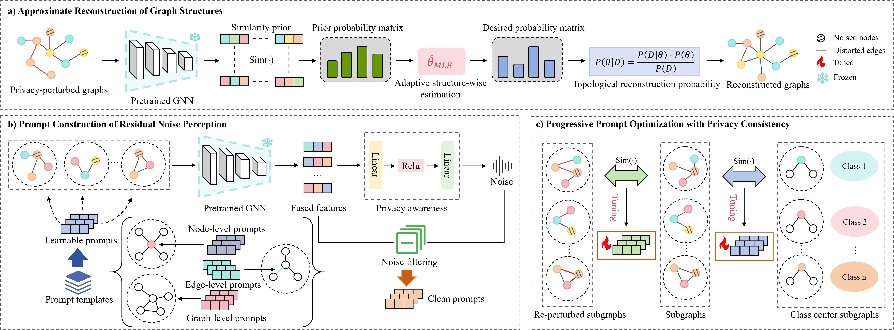

## PAGPL

This is the official implementation of "PAGPL: Privacy-Aware Graph Prompt Learning Scheme via
Adaptive Perturbation-Estimated Topology Recovery"

We will further fix the bugs, update the more robustness tests of GPL scenarios in the future.

We refer to the <ins>ProG</ins> library to build our GPL scenarios **src/** [https://github.com/sheldonresearch/ProG](https://github.com/sheldonresearch/ProG).

## Basic Environment
* `CUDA == 11.8`
* `Python == 3.10` 
* `PyTorch == 2.1.2`

## Dataset

We use seven widely used benchmark datasets: Cora, CiteSeer, PubMed, DD, ENZYMES

## Code Structure

prompt_graph/blink: The reconstruction of graphs

prompt_graph/privacy_preserving_graph: The generation of privacy graph data

prompt_graph/data: The graphic datasets and how to load graph as pytorch tensor

prompt_graph/evaluation: The evaluator for GPL tasks

prompt_graph/model: The graph encoders

prompt_graph/pretrain: Pretraining models

prompt_graph/prompt: Graph prompt paradigms

prompt_graph/tasker: GPL tasks

prompt_graph/utils: Other needed functions or classes

## Implementation

Pre-train: !python pre_train.py

Downstream-task: !python downstream_task.py

